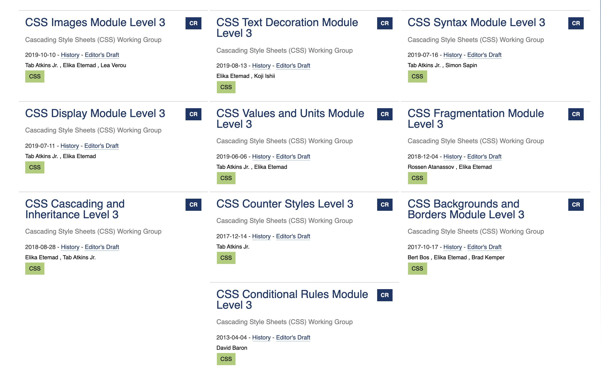
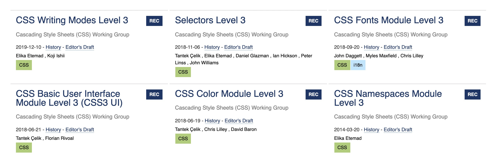

# 关于css3新增属性的考古文章,这种面试题是真的挺学究的

> 最近想换工作, 所以在看一下面试题, 面试题有看到这样一个问题, css3 新增属性有哪些.心里立马给出了第一反应的答案

- transfrom
- animal
- @keyframe
- :root
- flex
- grid
- 兄弟选择器
- 属性选择器

> 在心中回答完这些, 我不禁问自己一个问题, 是真的吗? 是所有吗? 里面会不会混着css2 的属性呢?

- 又是第一反应, 这个回答是, 我不确定. 

> 然后有问出一个问题 css3 标准是什么时候出来的? 

- 四年多前接触前端开始这个概念就有了,并且已经比较流行了,但这份标准什么时候开始,那就不得而知了

下面是我在寻找答案的一些资料

## mdn css 标准化进程

> 在mdn 中找到了有关 css 标准化的进程,而且有中文翻译,对我这个英语不太好的人来说真的是福音了
>
> 链接: https://developer.mozilla.org/zh-CN/docs/Archive/CSS3

首先他开宗明义的介绍了css3 

> **CSS3** 是*层叠样式表（Cascading Style Sheets）*语言的最新版本，旨在扩展CSS2.1。
>
> 它带来了许多期待已久的新特性， 例如圆角、阴影、[gradients(渐变)](https://developer.mozilla.org/zh-CN/docs/Web/Guide/CSS/Using_CSS_gradients) 、[transitions(过渡)](https://developer.mozilla.org/zh-CN/docs/Web/Guide/CSS/Using_CSS_transitions) 与 [animations(动画)](https://developer.mozilla.org/zh-CN/docs/Web/Guide/CSS/Using_CSS_animations) 。以及新的布局方式，如 [multi-columns](https://developer.mozilla.org/en/CSS/Using_CSS_multi-column_layouts) 、[ flexible box](https://developer.mozilla.org/zh-CN/docs/Web/Guide/CSS/Flexible_boxes) 与 grid layouts。实验性特性以浏览器引擎为前缀（vendor-prefixed），应避免在生产环境中使用，或极其谨慎地使用，因为将来它们的语法和语义都有可能被更改

在这段话中可以提取出几个属性

| 圆角          | 阴影       | gradients(渐变) | transitions(过渡) | animations          |
| :------------ | ---------- | --------------- | ----------------- | ------------------- |
| border-radius | box-shadow | linear-gradient | tansitions        | animation,@keyframe |

| multi-columns              | flexible box | grid layouts |
| -------------------------- | ------------ | ------------ |
| column-count, column-width | flex         | grid         |

很惭愧的是有一些特性我常用却自以为是css2 的特性: 比如 border-radius,box-shadows

还有不常用的multi-columns 布局和background:linear-gradient()

特别是多列布局,我以为是很久远的属性,都落伍了

## css3 形式上的消失

在这篇文章中提到, css 被分为了各个独立的模块,各自实现标准化

> 从形式上来说，CSS3 标准*自身已经不存在了*。每个模块都被独立的标准化，现在标准 CSS 包括了修订后的 CSS2.1 以及完整模块对它的扩充，模块的 level（级别）数并不一致。可以在每个时间点上为 CSS 标准定义一个 snapshots（快照），列出 CSS 2.1 和成熟的模块。

在文章中也提到了,css 标准化流程的几个稳定节点

> 有些 CSS 模块已经十分稳定，其状态为 CSSWG 规定的三个推荐品级之一：Candidate Recommendation（候选推荐）， Proposed Recommendation（建议推荐）或 Recommendation（推荐）。表明这些模块已经十分稳定，使用时也不必添加前缀， 但有些特性仍有可能在 Candidate Recommendation 阶段被放弃。

所以在css(https://wiki.csswg.org/) 官方网站中,带有 `CR`, `PR`,`REC`标致的标准是可以去稳定使用的

但在www.w3.org 中还有一个状态应该也是可以稳定使用的  Proposed Edited Recommendation(PER)

下面是css3中进行了修改,更新,新增并达到上面推荐等级的模块,共16个,而未被推荐,但标准化正在推进的应该还有,包括level 4的也有几个

在想想里面属性,就觉的这道题很难,问的这么普遍显得有点苛刻

## 那些新增的属性

就记录下在mdn 这篇文章中出现的属性吧,凌晨将近2点了,把所有属性找到怕是有的困难, 毕竟还有吃饭

### color

- opacity
- hsl()
- hola()
- rgba()
- rgb()

### Selector

| 属性选择器     | 伪类            | 伪类              | 伪元素                        | 兄弟选择器 |
| -------------- | --------------- | ----------------- | ----------------------------- | ---------- |
| E[attr^="val"] | :target         | :nth-of-type      | :before=>::before             | h1~pre     |
| E[attr$="val"] | :enabled        | :nth-last-of-type | :after => ::after             |            |
| E[attr*="val"] | :disabled       | :last-child       | :first-letter=>::first-letter |            |
|                | :indeterminate  | :first-of-type    | :first-line=>::first-line     |            |
|                | :root           | :last-of-type     |                               |            |
|                | :nth-child      | :only-child       |                               |            |
|                | :nth-last-child | :only-of-child    |                               |            |
|                | :root           | :empty            |                               |            |
|                | :not            |                   |                               |            |

### CSS Namespaces Module

@namespace

关于这个属性,我还有一篇未完待续的介绍文章, 写到一半就没继续, 争取之后写出来, 不过在工作中确实没用到过这个属性

### CSS Backgrounds and Borders Module Level 3

没有灵魂的cv

- [`background-repeat`](https://developer.mozilla.org/zh-CN/docs/Web/CSS/background-repeat) 属性的 `space` 和 `round` 值，还有支持两个值的语法。
- [`background-attachment`](https://developer.mozilla.org/zh-CN/docs/Web/CSS/background-attachment) `local` 值。
- CSS [`background-origin`](https://developer.mozilla.org/zh-CN/docs/Web/CSS/background-origin)，[`background-size`](https://developer.mozilla.org/zh-CN/docs/Web/CSS/background-size) 和 [`background-clip`](https://developer.mozilla.org/zh-CN/docs/Web/CSS/background-clip) 属性。
- 支持带弧度的 border corner(边框角) CSS 属性：[`border-radius`](https://developer.mozilla.org/zh-CN/docs/Web/CSS/border-radius)，[`border-top-left-radius`](https://developer.mozilla.org/zh-CN/docs/Web/CSS/border-top-left-radius)，[`border-top-right-radius`](https://developer.mozilla.org/zh-CN/docs/Web/CSS/border-top-right-radius)，[`border-bottom-left-radius`](https://developer.mozilla.org/zh-CN/docs/Web/CSS/border-bottom-left-radius) 和 [`border-bottom-right-radius`](https://developer.mozilla.org/zh-CN/docs/Web/CSS/border-bottom-right-radius) 。
- 支持边框使用 [``](https://developer.mozilla.org/zh-CN/docs/Web/CSS/image)： [`border-image`](https://developer.mozilla.org/zh-CN/docs/Web/CSS/border-image)，[`border-image-source`](https://developer.mozilla.org/zh-CN/docs/Web/CSS/border-image-source)，[`border-image-slice`](https://developer.mozilla.org/zh-CN/docs/Web/CSS/border-image-slice)，[`border-image-width`](https://developer.mozilla.org/zh-CN/docs/Web/CSS/border-image-width)，[`border-image-outset`](https://developer.mozilla.org/zh-CN/docs/Web/CSS/border-image-outset) 和 [`border-image-repeat`](https://developer.mozilla.org/zh-CN/docs/Web/CSS/border-image-repeat) 。
- 支持元素的阴影：[`box-shadow`](https://developer.mozilla.org/zh-CN/docs/Web/CSS/box-shadow) 。

### 未完待续

发现光这篇文章中的css3 属性,就多的惊人, 主要整理的时候看到不熟悉的,总要点击进去看看.因为需要休息了,没法继续cv大法下去了,具体可以去这几个网站上去了解

https://developer.mozilla.org/zh-CN/docs/Archive/CSS3(这篇文的主要内容来源)

https://www.w3.org/TR/

https://drafts.csswg.org/